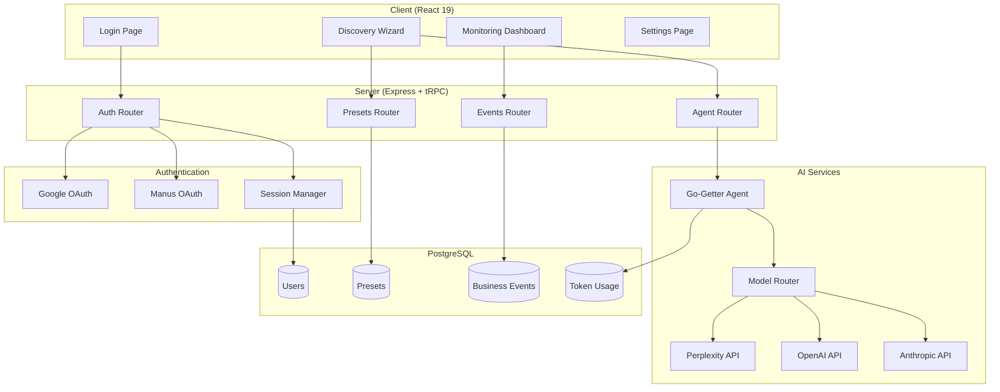
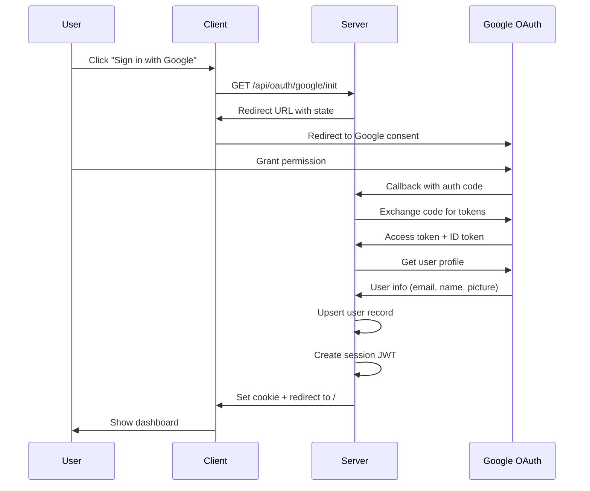

# Design Document: GO-GETTER OS Enhancements

## Overview

This design document outlines the architecture and implementation approach for enhancing the GO-GETTER OS platform with secure environment configuration, Google OAuth authentication, real AI agent execution, enhanced monitoring dashboards with time-series charts, and custom business discovery presets.

The enhancements build upon the existing React 19 + tRPC + PostgreSQL architecture, maintaining consistency with the current codebase patterns while adding new capabilities.

## Architecture

### High-Level Architecture



### Authentication Flow



## Components and Interfaces

### 1. Environment Validation Module

**Location:** `server/_core/env.ts`

```typescript
interface EnvironmentConfig {
  databaseUrl: string;
  jwtSecret: string;
  googleClientId?: string;
  googleClientSecret?: string;
  nodeEnv: 'development' | 'production' | 'test';
}

interface ValidationResult {
  valid: boolean;
  errors: string[];
  warnings: string[];
}

function validateEnvironment(): ValidationResult;
function generateSecureSecret(length?: number): string;
```

### 2. Google OAuth Service

**Location:** `server/_core/googleOAuth.ts`

```typescript
interface GoogleUserInfo {
  id: string;
  email: string;
  name: string;
  picture?: string;
  verified_email: boolean;
}

interface GoogleOAuthService {
  getAuthorizationUrl(state: string): string;
  exchangeCodeForTokens(code: string): Promise<GoogleTokens>;
  getUserInfo(accessToken: string): Promise<GoogleUserInfo>;
}
```

### 3. Go-Getter Agent Service

**Location:** `server/services/goGetterAgent.ts`

```typescript
interface UserPreferences {
  riskTolerance: 'conservative' | 'moderate' | 'aggressive';
  interests: string[];
  capitalAvailable: number;
  technicalSkills: string;
  businessGoals: string[];
}

interface BusinessOpportunity {
  name: string;
  description: string;
  vertical: string;
  scores: CompositeScores;
  estimatedRevenue: number;
  estimatedCosts: number;
  implementationGuide: string;
}

interface GoGetterAgent {
  discoverOpportunities(preferences: UserPreferences): Promise<BusinessOpportunity[]>;
  scoreOpportunity(opportunity: Partial<BusinessOpportunity>): CompositeScores;
}
```

### 4. Model Router Service

**Location:** `server/services/modelRouter.ts`

```typescript
type TaskType = 'research' | 'analysis' | 'generation' | 'scoring';
type ModelProvider = 'perplexity' | 'openai' | 'anthropic' | 'gemini';

interface ModelConfig {
  provider: ModelProvider;
  model: string;
  costPer1kTokens: number;
  capabilities: TaskType[];
}

interface ModelRouter {
  selectModel(taskType: TaskType, userConfigs: ApiConfig[]): ModelConfig;
  executeWithFallback<T>(
    taskType: TaskType,
    prompt: string,
    userConfigs: ApiConfig[]
  ): Promise<T>;
}
```

### 5. Discovery Presets Service

**Location:** `server/services/presets.ts`

```typescript
interface DiscoveryPreset {
  id: number;
  userId: number;
  name: string;
  config: UserPreferences;
  createdAt: Date;
  updatedAt: Date;
}

interface PresetsService {
  getPresets(userId: number): Promise<DiscoveryPreset[]>;
  createPreset(userId: number, name: string, config: UserPreferences): Promise<DiscoveryPreset>;
  deletePreset(userId: number, presetId: number): Promise<boolean>;
  getPresetCount(userId: number): Promise<number>;
}
```

### 6. Time-Series Events API

**Location:** `server/routers.ts` (events router extension)

```typescript
interface TimeSeriesDataPoint {
  timestamp: Date;
  value: number;
}

interface AggregatedEventData {
  revenue: TimeSeriesDataPoint[];
  costs: TimeSeriesDataPoint[];
  profit: TimeSeriesDataPoint[];
}

type TimeGrouping = 'hour' | 'day' | 'week';
type TimeRange = '24h' | '7d' | '30d' | '90d';

interface EventsTimeSeriesAPI {
  getAggregatedEvents(
    userBusinessId: number,
    timeRange: TimeRange,
    grouping: TimeGrouping
  ): Promise<AggregatedEventData>;
}
```

## Data Models

### New Database Tables

#### discovery_presets

```sql
CREATE TABLE discovery_presets (
  id SERIAL PRIMARY KEY,
  user_id INTEGER NOT NULL REFERENCES users(id),
  name VARCHAR(255) NOT NULL,
  config JSONB NOT NULL,
  created_at TIMESTAMP DEFAULT NOW() NOT NULL,
  updated_at TIMESTAMP DEFAULT NOW() NOT NULL,
  UNIQUE(user_id, name)
);
```

### Schema Updates

#### users table additions

```sql
ALTER TABLE users ADD COLUMN google_id VARCHAR(64);
ALTER TABLE users ADD COLUMN picture_url VARCHAR(500);
ALTER TABLE users ADD COLUMN auth_providers JSONB DEFAULT '[]';
CREATE UNIQUE INDEX idx_users_google_id ON users(google_id) WHERE google_id IS NOT NULL;
```

### Drizzle Schema Extensions

```typescript
// In drizzle/schema.ts

export const discoveryPresets = pgTable("discovery_presets", {
  id: serial("id").primaryKey(),
  userId: integer("user_id").notNull().references(() => users.id),
  name: varchar("name", { length: 255 }).notNull(),
  config: json("config").$type<UserPreferences>().notNull(),
  createdAt: timestamp("created_at").defaultNow().notNull(),
  updatedAt: timestamp("updated_at").defaultNow().notNull(),
});

// Update users table
export const users = pgTable("users", {
  // ... existing fields
  googleId: varchar("google_id", { length: 64 }),
  pictureUrl: varchar("picture_url", { length: 500 }),
  authProviders: json("auth_providers").$type<string[]>().default([]),
});
```

## Correctness Properties

*A property is a characteristic or behavior that should hold true across all valid executions of a system—essentially, a formal statement about what the system should do. Properties serve as the bridge between human-readable specifications and machine-verifiable correctness guarantees.*

### Property 1: JWT Secret Validation

*For any* string provided as JWT_SECRET, the validation function SHALL return valid=true if and only if the string length is >= 32 characters AND the string does not equal the placeholder value "your-random-secret-key-here".

**Validates: Requirements 1.2, 1.3**

### Property 2: User Record Management on OAuth

*For any* valid OAuth profile data (containing email and provider ID), signing in SHALL result in either:
- A new user record created with matching profile data (if no user exists with that provider ID), OR
- An existing user record with updated lastSignedIn timestamp (if user exists)

**Validates: Requirements 2.4, 2.5**

### Property 3: Session Cookie Round-Trip

*For any* valid user authentication, creating a session token and then verifying that token SHALL return the same user identity (openId) that was used to create it.

**Validates: Requirements 2.6, 2.8**

### Property 4: Composite Score Calculation Consistency

*For any* business opportunity with valid scoring factors (0-100 for each factor), the composite score calculation SHALL produce a value between 0 and 100, and the same inputs SHALL always produce the same output.

**Validates: Requirements 3.4**

### Property 5: Model Router Cost Optimization

*For any* set of configured API providers and a given task type, the model router SHALL select the model with the lowest cost-per-token among those capable of the task type.

**Validates: Requirements 3.3**

### Property 6: AI Interaction Logging Completeness

*For any* AI API call made by the Go-Getter agent, a token usage log entry SHALL be created containing: userId, modelProvider, modelName, inputTokens, outputTokens, and totalCost.

**Validates: Requirements 3.7**

### Property 7: Chart Data Time Range Filtering

*For any* time range selection (24h, 7d, 30d) and set of business events, the returned chart data SHALL contain only events with timestamps within the selected range, and events SHALL be correctly grouped by the specified time grouping (hour, day, week).

**Validates: Requirements 4.1, 4.2, 4.3, 4.5**

### Property 8: Preset Name Uniqueness

*For any* user attempting to save a preset, if a preset with the same name already exists for that user, the save operation SHALL fail with a uniqueness error.

**Validates: Requirements 5.2**

### Property 9: Preset Loading Completeness

*For any* saved preset, loading that preset SHALL restore all wizard fields to exactly the values that were saved, with no fields missing or modified.

**Validates: Requirements 5.3, 5.4**

### Property 10: Preset Count Limit Enforcement

*For any* user with 10 existing presets, attempting to create an 11th preset SHALL fail with a limit exceeded error.

**Validates: Requirements 5.6, 5.7**

### Property 11: Token Usage Aggregation Accuracy

*For any* set of token usage records, the aggregation by provider SHALL produce totals that equal the sum of individual records for each provider, and time-based aggregations SHALL correctly group records by the specified period.

**Validates: Requirements 6.2, 6.3, 6.4**

### Property 12: Event Storage Completeness

*For any* revenue or cost event logged, the stored record SHALL contain a non-null timestamp and amount, and the timestamp SHALL be within 1 second of the actual event time.

**Validates: Requirements 7.1, 7.2**

### Property 13: Event Aggregation by Time Period

*For any* query for aggregated events with a specified time grouping, the returned data points SHALL be correctly grouped such that all events within each group's time window are summed together.

**Validates: Requirements 7.3, 7.4**

### Property 14: Account Linking by Email

*For any* user signing in with a new OAuth provider where the email matches an existing user account, the new provider SHALL be added to the existing user's authProviders array without creating a duplicate user record.

**Validates: Requirements 8.2, 8.3**

## Error Handling

### Authentication Errors

| Error Code | Condition | User Message |
|------------|-----------|--------------|
| AUTH_GOOGLE_FAILED | Google OAuth callback fails | "Google sign-in failed. Please try again." |
| AUTH_TOKEN_EXPIRED | Session JWT expired | "Your session has expired. Please sign in again." |
| AUTH_INVALID_STATE | OAuth state mismatch | "Authentication error. Please try again." |

### Agent Errors

| Error Code | Condition | User Message |
|------------|-----------|--------------|
| AGENT_NO_API_CONFIGURED | No AI APIs configured | "Please configure at least one AI API in settings." |
| AGENT_ALL_MODELS_FAILED | All model fallbacks exhausted | "Unable to process request. Please try again later." |
| AGENT_RATE_LIMITED | API rate limit hit | "Request limit reached. Please wait a moment." |

### Preset Errors

| Error Code | Condition | User Message |
|------------|-----------|--------------|
| PRESET_NAME_EXISTS | Duplicate preset name | "A preset with this name already exists." |
| PRESET_LIMIT_REACHED | 10 presets already exist | "Maximum preset limit reached. Delete a preset first." |
| PRESET_NOT_FOUND | Preset ID doesn't exist | "Preset not found." |

## Testing Strategy

### Unit Tests

Unit tests will focus on:
- Environment validation logic
- JWT secret strength validation
- Composite score calculation
- Time range filtering logic
- Preset CRUD operations
- Token usage aggregation

### Property-Based Tests

Property-based tests will use **fast-check** library for TypeScript with minimum 100 iterations per test.

Each property test will be tagged with:
- Feature name: `go-getter-enhancements`
- Property number and description
- Requirements reference

**Test Configuration:**
```typescript
import fc from 'fast-check';

// Minimum 100 iterations for all property tests
const PBT_CONFIG = { numRuns: 100 };
```

**Property Test Examples:**

```typescript
// Property 1: JWT Secret Validation
describe('JWT Secret Validation', () => {
  it('should validate secrets >= 32 chars that are not placeholder', () => {
    fc.assert(
      fc.property(
        fc.string({ minLength: 32, maxLength: 256 }),
        (secret) => {
          if (secret === 'your-random-secret-key-here') return true; // skip placeholder
          const result = validateJwtSecret(secret);
          return result.valid === true;
        }
      ),
      PBT_CONFIG
    );
  });
});

// Property 4: Composite Score Consistency
describe('Composite Score Calculation', () => {
  it('should produce consistent scores between 0-100', () => {
    fc.assert(
      fc.property(
        fc.record({
          guaranteedDemand: fc.integer({ min: 0, max: 100 }),
          automationLevel: fc.integer({ min: 0, max: 100 }),
          tokenEfficiency: fc.integer({ min: 0, max: 100 }),
          profitMargin: fc.integer({ min: 0, max: 100 }),
          maintenanceCost: fc.integer({ min: 0, max: 100 }),
          legalRisk: fc.integer({ min: 0, max: 100 }),
          competitionSaturation: fc.integer({ min: 0, max: 100 }),
        }),
        (scores) => {
          const result1 = calculateCompositeScore(scores);
          const result2 = calculateCompositeScore(scores);
          return result1 === result2 && result1 >= 0 && result1 <= 100;
        }
      ),
      PBT_CONFIG
    );
  });
});
```

### Integration Tests

Integration tests will cover:
- Full OAuth flow with mocked Google responses
- End-to-end preset save/load cycle
- Chart data API with real database queries
- Agent execution with mocked AI responses
